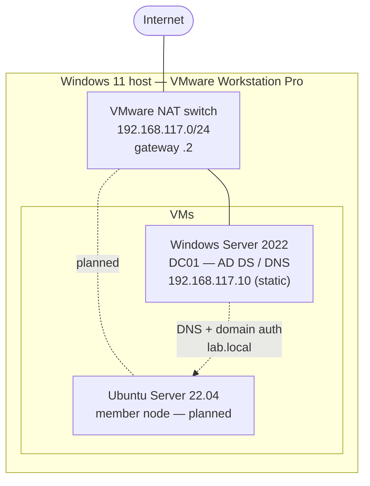
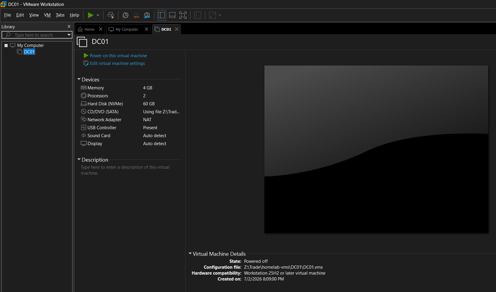
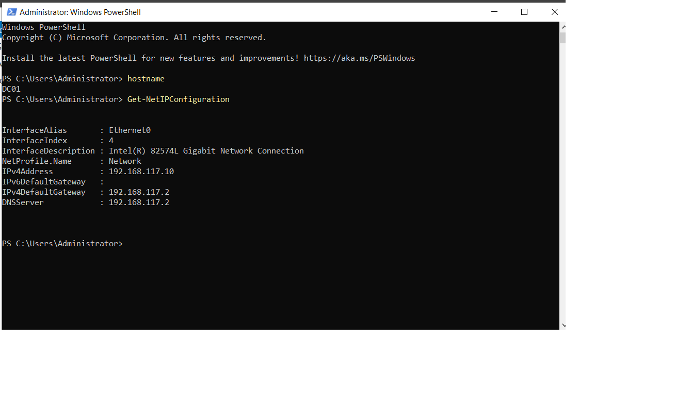
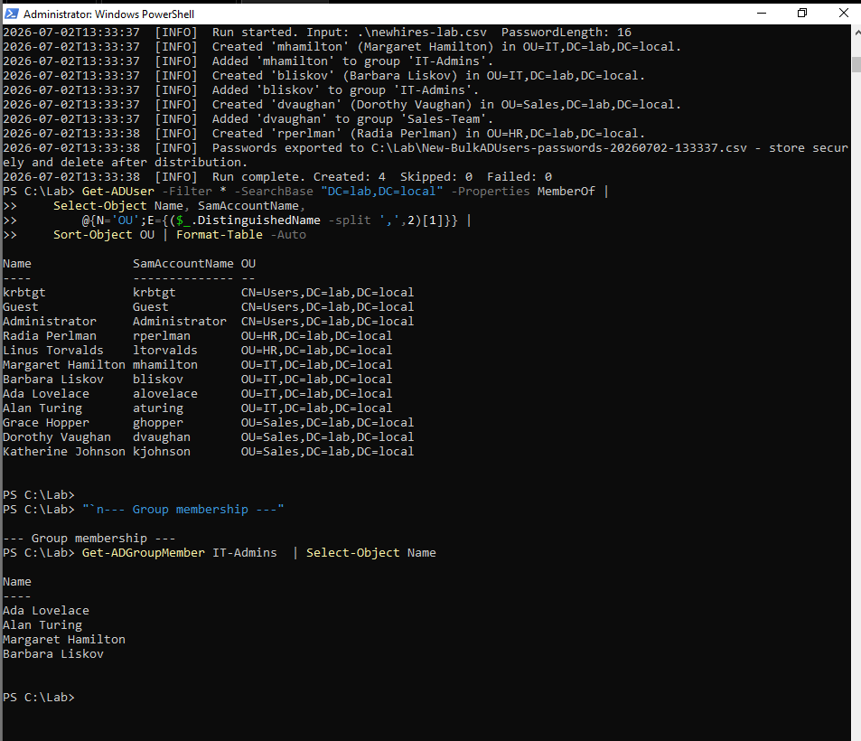

# Homelab

A virtualized homelab built to practice real Windows system administration:
a **Windows Server 2022 Active Directory domain** (`lab.local`) running on
**VMware Workstation Pro**, with organizational units, users, groups, Group
Policy, and **PowerShell automation driving user provisioning end-to-end**.
This repo is both a build record and my interview-prep script — the lab can be
rebuilt from scratch by following the guides.

> **Status: Core domain lab complete and verified.** DC01 promoted to a Domain
> Controller for `lab.local`; OUs, users, groups, and two GPOs created;
> [`New-BulkADUsers.ps1`](https://github.com/alikamkar98/it-automation-toolkit)
> run successfully against the live domain (screenshots below). A Linux member
> node (Ubuntu + realmd/SSSD domain join) is documented and planned as the next
> extension.

---

## What was built

| Component | Role | IP | Platform |
| --- | --- | --- | --- |
| **DC01** | Domain Controller, DNS | 192.168.117.10 (static) | Windows Server 2022 (Desktop Experience) on **VMware Workstation Pro** |
| NAT gateway | Router / DNS forwarder | 192.168.117.2 | VMware NAT (`192.168.117.0/24`) |
| _Ubuntu member (planned)_ | Linux services + domain join | — | Ubuntu Server 22.04 LTS |

**Domain:** `lab.local` (NetBIOS `LAB`)
**Hypervisor:** VMware Workstation Pro (free for personal use)
**VM spec:** 4 GB RAM, 2 vCPU, 60 GB thin disk, NAT networking

### Directory structure

- **OUs:** `IT`, `Sales`, `HR`
- **Groups:** `IT-Admins`, `Sales-Team`
- **Users:** 5 created by hand + 4 provisioned by `New-BulkADUsers.ps1`
- **GPOs:** `Lab - Screen Lock 15min` (domain-wide, 15-min inactivity lock),
  `Lab - Sales Restrictions` (hides Control Panel for the Sales OU)

---

## Network diagram

---

## Screenshots

| Step | Evidence |
| --- | --- |
| VM created on VMware Workstation Pro (4 GB / 2 CPU / 60 GB thin / NAT) |  |
| Static IP `192.168.117.10` + hostname `DC01` |  |
| `New-BulkADUsers.ps1` provisioning users into the live `lab.local` domain |  |

---

## Build guides

The step-by-step guides in [`docs/`](docs/) cover the full build. The AD DS,
GPO, and Ubuntu guides apply directly to this VMware build; the host-setup guide
also documents a Proxmox alternative.

| # | Guide | What it covers |
| --- | --- | --- |
| 1 | [Host setup](docs/01-proxmox-host.md) | Hypervisor host + creating VMs (VMware Workstation Pro / Proxmox) |
| 2 | [Windows Server AD DS](docs/02-windows-server-adds.md) | Installing Windows Server, promoting to a Domain Controller, OUs and users |
| 3 | [GPO configuration](docs/03-gpo-configuration.md) | Group policies: screen-lock baseline + OU-scoped restriction |
| 4 | [Ubuntu Server](docs/04-ubuntu-server.md) | Installing Ubuntu, joining the domain, hosting a service (planned) |
| 5 | [Lessons learned](docs/05-lessons-learned.md) | What broke, what I'd do differently, interview talking points |

---

## Skills demonstrated

- Type-2 hypervisor administration (**VMware Workstation Pro**): VM creation,
  thin-provisioned disks, NAT networking, VMware Tools, shared folders
- Windows Server 2022 install and initial configuration (static IP, rename)
- Active Directory Domain Services: forest/domain promotion, OUs, users, groups
- DNS on Windows Server (AD-integrated zone)
- Group Policy design (domain-wide and OU-scoped) via PowerShell
- **PowerShell automation** — bulk user provisioning from CSV against a live
  domain, with `-WhatIf` previewing and logging
- Documentation and reproducible builds

---

## How to use this repo

Follow the guides in order. Every guide lists prerequisites, numbered steps, and
verification commands so you can confirm each stage before moving on. Free
software throughout: **VMware Workstation Pro** (free for personal use),
Windows Server 2022 (180-day evaluation), Ubuntu Server (free).
