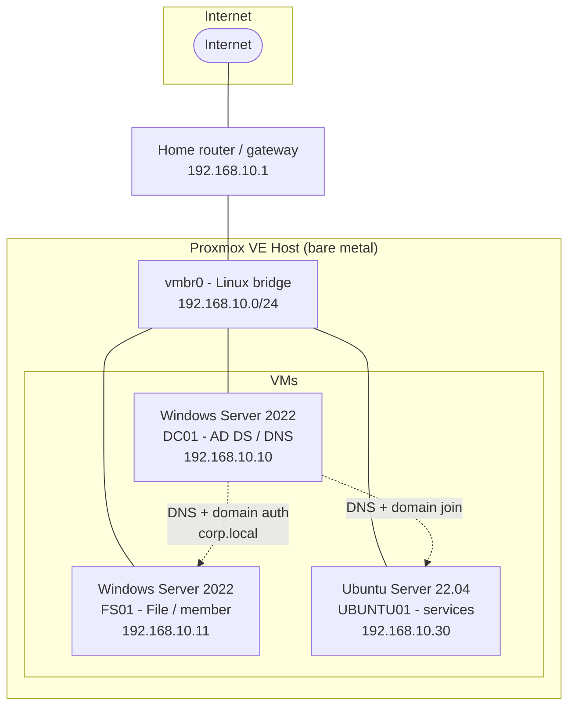

# Homelab

Documentation for a virtualized homelab built to practice real
Windows/Linux system administration: a Proxmox host running a **Windows Server
2022 Active Directory domain**, group policy, and an **Ubuntu Server** member
node. This repo is both a build guide and my interview-prep script — each doc is
written so the lab can be rebuilt from scratch.

> **Status: In progress** — architecture and step-by-step build guides written
> (Proxmox host, Windows Server AD DS, GPO, Ubuntu domain join). VM build and
> screenshots are being added as I stand up the lab.

<!-- Screenshots for each step will live in screenshots/ and be linked from the
     guides once captured. -->

---

## Network diagram

| Host | Role | IP | OS |
| --- | --- | --- | --- |
| DC01 | Domain Controller, DNS, DHCP | 192.168.10.10 | Windows Server 2022 |
| FS01 | Member server / file server | 192.168.10.11 | Windows Server 2022 |
| UBUNTU01 | Linux member node (services) | 192.168.10.30 | Ubuntu Server 22.04 LTS |
| Gateway | Router | 192.168.10.1 | — |

**Domain:** `corp.local`

---

## Build guides

| # | Guide | What it covers |
| --- | --- | --- |
| 1 | [Proxmox host setup](docs/01-proxmox-host.md) | Installing Proxmox VE, networking, creating VMs |
| 2 | [Windows Server AD DS](docs/02-windows-server-adds.md) | Installing Windows Server, promoting to a Domain Controller, OUs and users |
| 3 | [GPO configuration](docs/03-gpo-configuration.md) | Two group policies: password policy + desktop/security baseline |
| 4 | [Ubuntu Server](docs/04-ubuntu-server.md) | Installing Ubuntu, joining the domain, hosting a service |
| 5 | [Lessons learned](docs/05-lessons-learned.md) | What broke, what I'd do differently, interview talking points |

---

## Skills demonstrated

- Type-1 hypervisor administration (Proxmox VE)
- Windows Server 2022 install and hardening
- Active Directory Domain Services: forest/domain, OUs, users, groups
- Group Policy design and troubleshooting (`gpupdate`, `gpresult`)
- DNS and DHCP on Windows Server
- Linux server administration and domain integration (SSSD/realmd)
- Documentation and reproducible builds

---

## How to use this repo

Follow the guides in order. Every guide lists prerequisites, numbered steps, and
verification commands so you can confirm each stage before moving on. Free
software throughout: Proxmox VE (free), Windows Server 2022 (180-day eval),
Ubuntu Server (free).
